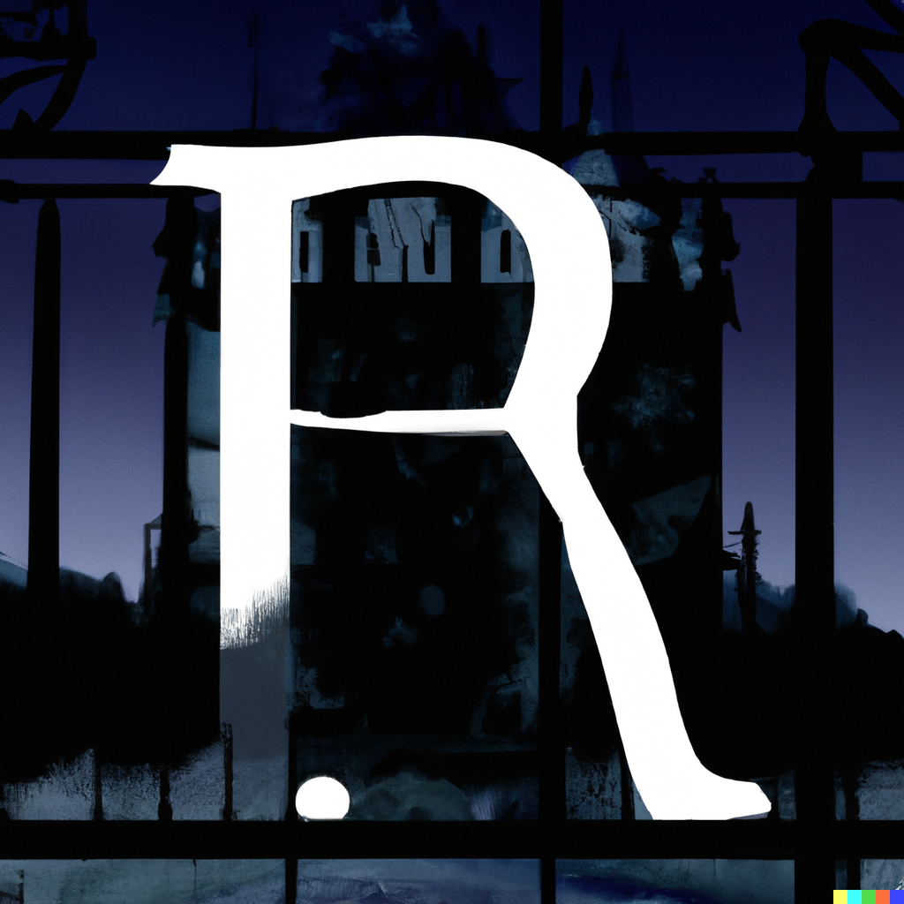

# INESCAPtABLE

Escape from the manor - a CSV based escape room (intended but not limited to R).  Play the game by downloading [INESCAPtABLE.Rmd](INESCAPtABLE.Rmd), reading the prompts, & solving the clues to decrypt hidden messgaes.

To escape the manor you have to decipher clues, manipulate data, and even build a linear regression model.

-----

Audio intro: 

<audio controls>   <source src="INESCAPtABLE-tts-intro.mp3" type="audio/mpeg">   Your browser does not support the audio element. </audio>

Text intro:

> You wake up in a fog in a weird-looking house. You don't remember how you got here; you must be dreaming. You move to take a step, but a loud creak paralyzes you. Quickly, carefully, you glance down; what catches your eye isn't the beautiful oak floors but a rolled-up piece of paper sticking out of your sock. You pull it out and unroll it. It's a note.
>
> You try to read the hastily written note. It's in your handwriting, and the penmanship is as good as ever, but you can't read it. The only thing you can make out is tiny writing in the corner that says `key = 42`. Besides that, the note looks like random letters.
>
> The mention of `key = 42` has to mean something about how to decipher the note. At least, that's what we have to hope.

